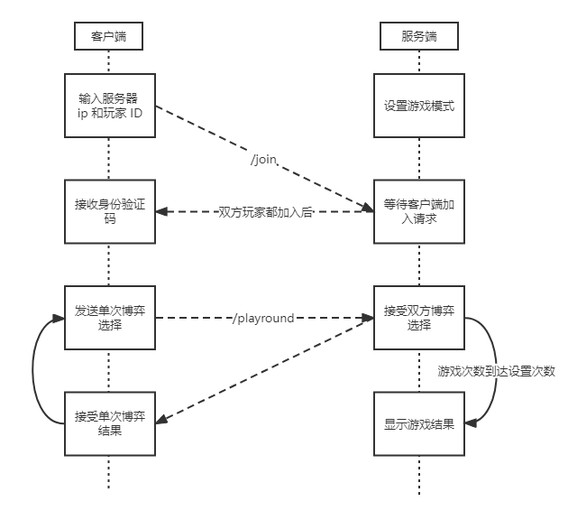

# Cyber-Prisoner

## 前言

本题希望大家开发一个简单的客户端-服务端系统来进行简单的囚徒困境博弈。在正式开始本题之前，我们希望大家做到以下几点：

- 分阶段实现基本的客户端服务端通信和博弈算法。具体要求会在下文中提出。
- 有充分的、有条理的、尽可能简明规范的注释。
- 学会自己在网络上查找合适的文档资料并自主学习完成。**这份教程没有给出充分的实现细节，这旨在驱动大家自己动手充分利用互联网获取自己想要的信息。**
- 编写一份简明的文档，列出主要函数的调用方式、参数信息、重要注释等。
- 如果实现全部的功能比较困难，**可以只实现部分**。我们最终考察的并非只是题目的完成度，更多的是考察学习能力和态度。

最后需要大家提交的文件包括源代码和文档。

下面是一些额外的要求，希望大家尽量去做：

- 使用 Golang 语言。当然，如果你没有任何 Golang 基础，可能会比较困难，那么你可以使用其他你较为熟悉的语言。如果你对 Golang 非常熟悉，那么可以试试其他你没那么熟悉的语言，比如 Java 等。这条是希望大家在能力范围内勇于使用自己舒适区外的语言，同时学会查阅语言文档。
- 规范化编程。规范化的编程不仅可以增加代码的可读性，还可以避免一些意料之外的 bug。
- 模块化编程。模块化的编程便于调试，也可以使代码更易读。
- 使自己的代码文件可以供他人作为库导入。为此，你撰写的文档应当足够明晰（不需要卷！）。

准备好了吗？我们开始吧！

## 参考文档

- [Git Documentation](https://git-scm.com/doc)
- [Git Tutorial](https://www.runoob.com/git/git-tutorial.html)
- [What is Secure Shell(SSH)](https://en.wikipedia.org/wiki/Secure_Shell)
- [Markdown Guide](https://www.markdownguide.org/basic-syntax/)
- [Markdown Tutorial](https://www.runoob.com/markdown/md-tutorial.html)
- [The Little Go Book](https://www.openmymind.net/assets/go/go.pdf)
- [What is Hypertext Transfer Protocol(HTTP)](https://en.wikipedia.org/wiki/Hypertext_Transfer_Protocol)
- [HTTP Tutorial](https://www.runoob.com/http/http-tutorial.html)

## 囚徒困境博弈

您可能听说过囚徒困境这一个著名的博弈问题，而这一道二面题希望您实现的就是两位玩家之间的囚徒困境博弈。

先简单介绍一下囚徒困境。囚徒困境最早是由美国普林斯顿大学数学家阿尔伯特·塔克（Albert tucker）1950年提出来的。他当时编了一个故事向斯坦福大学的一群心理学家们解释什么是博弈论，这个故事后来成为博弈论中最著名的案例。故事内容是：两个嫌疑犯( A 和 B )作案后被警察抓住，隔离审讯；警方的政策是“坦白从宽，抗拒从严”，如果两人都坦白则各判 8 年；如果一人坦白另一人不坦白，坦白的放出去，不坦白的判 10 年；如果都不坦白则因证据不足各判 1 年。

单次发生的囚徒困境，和多次重复的囚徒困境结果不会一样。在重复的囚徒困境中，博弈被反复地进行。因而每个参与者都有机会去“惩罚”另一个参与者前一回合的不合作行为。这时，合作可能会作为均衡的结果出现。欺骗的动机这时可能被受到惩罚的威胁所克服，从而可能导向一个较好的、合作的结果。作为反复接近无限的数量，纳什均衡趋向于帕累托最优。

在这道题目中，我们要求各位在客户端实现一个博弈机器人，即发送当前的博弈选择到服务器，接受服务器返回的结果然后进行下一次的博弈选择。当游戏结束后需要返回游戏过程中的每一回合博弈结果和整局游戏结果，整局游戏结果我们设置为 **“整局游戏中每一回合被判年数总和较小的玩家获胜”**。需要提醒各位的是，博弈的算法可以由各位自由选择，**如果对博弈不熟悉，那么可以选择简单的博弈算法甚至直接采用手动博弈，这一部分并非我们考察的重点**。

## 理清逻辑

很显然，上述**囚徒困境博弈**的模拟可以通过一份代码来完成，我们可以设计一个“警察”函数，用于接收囚犯的选择，我们也可以设计两个“囚犯”函数，用来发出囚犯的选择，以下给出伪代码。

```golang
func main(){
    choice1 := prisoner1_make_choice()
    choice2 := prisoner2_make_choice()
    result := police_receive_choice(choice1, choice2)
    output(result)
}
```

可是，如果将代码塞进一个文件，我们就只能在一台电脑上自己和自己囚徒博弈，这是在蔑视我们的创造力！我们当然希望能够在两台电脑上进行囚徒博弈（当然，在调试阶段，您可能需要在一台电脑上精神分裂，但是我们鼓励您借用室友的电脑进行多机调试）

接下来需要分析一下，从上述的代码到题目希望您写的代码，我们还缺少什么技术。

为了方便连接，我们规定服务端的 HTTP 端口为 50000 。我们可以把**警察**相关的代码提取出来，放在一个程序里面，称之为**服务端**。也可以把**囚犯**的代码提取出来，放在一个程序里面，称之为**客户端**。这样，整个模型就变成了，**客户端**向**服务端**表示自己的选择，**服务端**向**客户端**回复结果。当然，由于表示的方法变了，具体的逻辑也就产生了一些变化，您可以通过后文给出的接口格式来发现这些变化。

如果您足够仔细，您应该会发现，**客户端向服务端表示**与**服务端向客户端回复**是类似的操作，我们称之为**通信**，在上述的伪代码中，我们的**通信**是通过函数**传递参数**与**返回值**来实现的，而在这道题目中，我们要选择另一个**通信**方式。这就是这道题目主要想要您学会的技术。

首先，这个通信方式肯定是要能够跨电脑的，于是我们马上可以提出一个日程生活中遇见的 **HTTP 请求**，把你的**客户端**想象成浏览器，**服务端**想象成某个网站，你在网站上勾选按钮**我要坦白**，选择提交后收到结果**你被判了8年**，这其中起到**通信**功能的，就是 **HTTP 请求**。准确来说 **HTTP** 是一种**协议**，依照这种协议，浏览器发出了请求，而其他也依照这些协议的网站就能接受这些请求，并给予回复。

说到协议，我们还需要提一嘴，如果有一个场景，囚徒讲着警察所听不懂的方言，那么这个博弈还能进行下去吗？一般来说是不行的，所以在**客户端**和**服务端**通信的过程中，我们也需要自己规定一个**协议**，在后文中，我们称之为**请求格式**和**返回值格式**。

总结一下，我们需要些两份代码代表警察和囚徒，其中数据的通信通过HTTP协议来传递（当然，还有很多别的方法可以通信，如果您学有余力，可以去了解以下 RPC 调用）。那么，您已经可以开始查资料了。

哦，当然，往往原始的HTTP框架依旧过于复杂，会考虑到无数本题涉及不到的细节，所以我们允许您使用**库/包/框架**来简化**HTTP**请求的这一步。

## 逻辑流程

根据上述逻辑，我们可以将客户端和服务端之间的交互用以下的流程图进行简化，而您需要完成的也就是流程图中的环节。



## 服务端

服务端是管理客户端和游戏进度的中心枢纽。对于这道题，我们列出以下需求，希望能您的代码中实现：

| 需求                     | 需求描述                                                     | HTTP 路由           |
| ------------------------ | ------------------------------------------------------------ | ------------------- |
| 检查网络连通性           | 服务端在接收到客户端发来请求后返回成功提示                   | `[GET]` /ping       |
| 设置游戏模式             | 服务端在启动时设置提示玩家输入游戏模式（即进行多少轮次的博弈） | /                   |
| 接受玩家加入对局请求     | 服务器接受客户端发送的加入对局请求，收到两个请求后开始对局   | `[POST]` /join      |
| 接受客户端发送的博弈选择 | 接受客户端向指定路由发送的博弈选择                           | `[POST]` /playround |
| 游戏结束后打印结果       | 在指定轮次的博弈结束后，服务端打印最终结果，具体格式见后文描述 | /                   |

以上是服务端需要实现的基本需求，在此基础上，您可以自由拓展更多的功能，提升玩家对战体验，例如返回单次博弈结果之前稍作停顿，防止对局进行过快。但请注意，在拓展功能的时候需要保证只要是符合上述规范的客户端都能和服务端正常通信，不能因为添加了额外功能而不向下兼容。

由于服务端需要和所有客户端通信，因此两者之间通信的消息格式需要得到规范。在此，我们列出以下请求和返回值格式（采用 JSON 格式，这也是在数据交互中非常常用的一种格式）：

- 通用格式：

    所有的返回值都需要符合以下格式：

    ```json
    {
        "code": 0,      //错误码，非 0 表示失败
        "msg": "",      //错误描述
        "data":         //数据主体
    }
    ```

    在后续的返回值格式描述中，我们将**略去通用部分**，只描述数据主体（即 data 部分）的格式。

- `[GET]` /ping

  返回值：
  
  ```json
  {
      "msg": "pong"
  }
  ```
  
- `[POST]` /join
  
  请求体：
  
  ```json
  {
      "id": "QSCTech"             //玩家 ID
  }
  ```
  
  返回值：
  
  ```json
  {
      "user_token": "*************"   //玩家身份验证 token，用于客户端在后续发送消息时表明自身身份信息
  }
  ```
  
  可能的错误情况：
  
  - 服务端已经接收到两个客户端的加入请求且对局已开始，此时收到的加入请求应返回错误，例如
  
      ```json
      {
          "code": 100,
          "msg": "game has already started"
      }
      ```
  
  - 请求中没有提供玩家 ID ，则对此请求应返回错误，例如
  
      ```json
      {
          "code": 101,
          "msg": "should provide gamer ID"
      }
      ```
  
  - ......
  
- `[POST]` /playround

    查询参数：

    | 名称       | 类型   | 描述               |
    | ---------- | ------ | ------------------ |
    | user_token | string | 玩家身份验证 token |

    请求体：

    ```json
    {
        "choice": "confess"         //表示玩家选择坦白，不坦白则为 "deny"
    }
    ```

    返回值：

    ```json
    {
        "your_choice": "confess",       //玩家选择
        "op_choice": "deny",            //对方玩家选择
        "your_result": 0,               //玩家被判年数
        "op_result": 10                 //对方玩家被判年数
    }
    ```

    可能的错误情况：

    - 请求体中的 choice 字段不是 "confess" 或 "deny"，则应返回错误，例如

        ```json
        {
            "code": 200,
            "msg": "undefined choice"
        }
        ```

    - 指定超时时间后仍未收到对方玩家的请求，则应返回错误，例如

        ```json
        {
            "code": 201,
            "msg": "opponent did not request"
        }
        ```

    - ......

- 服务端打印格式

    ```json
    {
        "results": [
            {
                "round": 1,             //博弈轮次
                "your_choice": true,    //玩家选择
                "op_choice": false,     //对方玩家选择
                "your_result": 0,       //玩家被判年数
                "op_result": 10         //对方玩家被判年数
            },
            {
                "round": 2,
                "your_choice": false,
                "op_choice": false,
                "your_result": 1,
                "op_result": 1
            }
        ],
        "your_sum": 1,                  //玩家被判年数总和
        "op_sum": 11,                   //对方玩家被判年数总和
        "status": true                  //玩家是否获胜
    }
    ```
    
    这里采用 JSON 格式仅仅是为了和上文保持统一以及便于表示格式，您在打印的时候不需要按照 JSON 格式，只要清晰明了就可以。

## 客户端

客户端是面向玩家的节点，负责将博弈选择发送到服务端并接收结果。类似地，我们对客户端也提出了一些基本需求希望您实现：

| 需求             | 需求描述                                                     |
| ---------------- | ------------------------------------------------------------ |
| 连接服务端       | 在玩家打开客户端后提示玩家输入服务端 URL 并向服务端发送连接请求 |
| 提示玩家输入 ID  | 在玩家打开客户端时提示玩家输入 ID                            |
| 输出单次博弈结果 | 在服务端返回单次博弈结果后将结果输出给玩家                   |

客户端由于是面向用户的一端，会有更多的交互内容，因此可供您自行拓展的部分会更多，例如玩家选择算法自动博弈模式或手动博弈模式等。还是同样提醒您，在拓展的时候要兼容我们的基本需求。

## 总结与反思

在文档中，需要你在开头或者结尾部分回答下列问题：

1. 你觉得解决这个任务的过程有意思吗？
2. 你在网上找到了哪些资料供你学习？你觉得去哪里/用什么方式搜索可以比较有效的获得自己想要的资料？
3. 在过程中，你遇到最大的困难是什么？你是怎么解决的？
4. 完成任务之后，再回去阅读你写下的代码和文档，有没有看不懂的地方？如果再过一年，你觉得那时你还可以看懂你的代码吗？
5. 其他想说的想法或者建议。

那么二面题就到这里了, 期待与你的见面~

以上。
