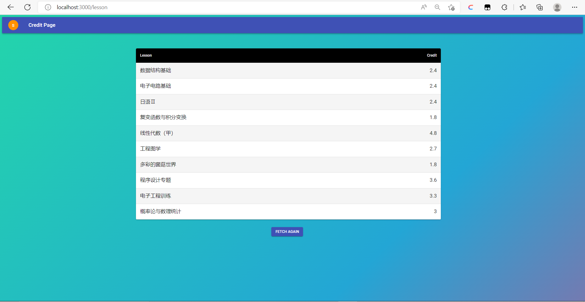

### 2022 Front-end RandomCredit
这道题适合**有一定前端开发基础的同学**选做。好消息是，如果您拥有完成此题的能力，那么它可能成为3道前端题中代码量最小的一道题x

在这道题中，我们希望您使用我们提供的代码，在本地起一个虚拟服务器，并自己撰写前端的代码，与这个服务器上的后端（在您不修改 [config](./serve/config.js) 的情况下，它应当在 **http://localhost:9999** 上）进行交互。同时，我们默认您的前端部署在 **http://localhost:3000** 上，如果您的部署地址不在这里，请前往修改 [config](./serve/config.js) 中的相关内容。

当然，最后我们还希望您在谈谈做完题之后的感想、收获、遇到的坑点……什么都可以！

为此，您需要的知识有：

- 使用npm/yarn
- 调用接口
- 使用路由
- 进行基本的美化、排版
- 在登录过期时，自动跳回登录页

**我们非常鼓励您在这道题中利用npm/yarn下载并使用任何的框架或包。**

这道题的文档将会分散在根目录下，您可以自行阅读您需要的部分。
[Node.js&npm](./Node.js%26npm.md)
[与后端交互](./与后端交互相关文档.md)

#### demo 中使用的包、框架
[react](https://zh-hans.reactjs.org/) 使用 [create-react-app](https://zh-hans.reactjs.org/docs/create-a-new-react-app.html#create-react-app) 搭建脚手架

[Material-UI](https://mui.com/material-ui/)

[react-router-dom](https://github.com/remix-run/react-router/tree/main/packages/react-router-dom)

[axios](https://www.axios-http.cn/)

如果您需要使用 react 以及它配套的路由，您还可以参考 [react-router-dom 中文教程](https://serializedowen.github.io/docs/react-router-dom/%E5%90%91%E5%AF%BC/%E5%BF%AB%E9%80%9F%E5%BC%80%E5%A7%8B)

当然，这只是一个示例，您完全可以挑选您喜欢的框架或库，比如说主流三大框架之一的 [Vue](https://cn.vuejs.org/) ，<del>来自 DASHgg 的推荐</del> [antdPro](https://pro.ant.design/zh-CN/) 等等等等。用原生写也完全可以接受。

#### demo 展示

一个简陋的登录页面。<del>怎么有人都用轮子了还写得这么难看啊</del>包含的要素有
- 名称输入框
- id输入框
- 登录按钮
- 一个……显示欢迎词的按钮

>这句欢迎词……可不是普通的欢迎词！它是从后端发来的欢迎词！

您可以在``serve``文件夹下找到后端提供的所有接口的[接口文档](./serve/README.md)。其中有一个``hello``的接口，您需要调用这个接口，把接收到的欢迎词呈现在用户面前。

*只要能有一个弹出来的东西把句子显示出来就行。哪怕是原生的 [alert](https://zh.javascript.info/alert-prompt-confirm#alert) 也是可以接受的。*

**这句欢迎词，和后续的课程/绩点信息都需通过接口从后端获取。如果被出题人发现您的代码里直接把这些东西写在了前端，后 果 很 严 重。**

先填写用户名和 id ，点击 LOGIN（登录按钮，您想叫什么都可以）后，在格式正确的情况下会跳转到`/lesson`页

请注意最上方，**url** 的变化。您不需要严格把登录页写在`/`而把绩点展示页写在`/lesson`，但您必须保证**两个页面处于两个不同的路径下**。

如您所见，`/lesson`页面中的课程名称、绩点都是从后端获取的。这一页还需要一个按钮，点击之后可再次获取课程、绩点信息，刷新表格。
*不用按钮也可，只要是一个可以通过交互重新获取数据的东西就行*

值得注意的是，出题人<del>瞎</del>写了一个cookie,它会在一定时间之后失效，在cookie失效后请求，无法请求到所需的数据。

我们希望您在出现这种情况的时候（比如说，在 cookie 失效后点击重新获取课程、绩点的按钮），**给予用户再次登录的提示后，让用户回到登录页**。

出题人 写 demo 的时候，这一步处理为用户点击“OK”后跳回登录页。这一步具体的实现随意，如果您希望的话，先冒出提示，一定时间后自动跳回登录页也是可行的。

说到 cookie，接口文档里还包含一个自动登录接口，如果能用它实现在 cookie 还在有效期内时进入登录页自动跳转到`/lesson`页面，并使用这个接口中获得的用户信息发请求获得课程绩点信息，就更好啦~

#### Task总结
- 写一个要素齐全的登录页（用户名、id输入框，登录、问候按钮）
- 在另一路径下写绩点展示页
- 展示页内包含重新获取数据的按钮
- 所有数据从后端获取
- 需要做两处弹窗提示（问候语和登录过期）
- 登录过期后设法让用户回到登录页
- 做一些基本的排版美化（不能让所有东西都挤在左上角）

#### 在 repository 里包含的内容
- 您的代码。如果使用了 npm ，请上传**除了node_modules**以外的所有文件
- 您的感想，推荐使用 Markdown 编写
- 如果有修改 config.js，请把它也一并上传（否则出题人就默认没改啦）
- 不推荐修改 serve 里面的其他东西。如果有修改，请整个文件夹**除了node_modules**一起上传

