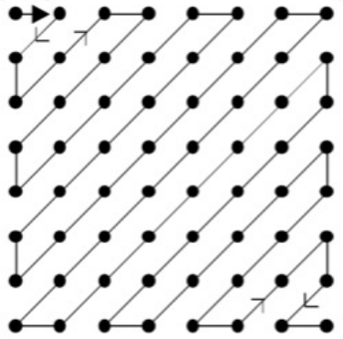

# What-is-JPEG

## 前言

本题希望大家了解 JPEG 压缩编码过程，并使用一门编程语言自己动手从零开始实现一个简单的 JPEG 压缩工具。在正式开始本题之前，我们希望大家做到以下几点：

- 分阶段实现基本的 JPEG 压缩算法。具体要求会在下文中提出。
- 有充分的、有条理的、尽可能简明规范的注释。
- 学会自己在网络上查找合适的文档资料并自主学习完成。**这份教程没有给出充分的实现细节，这旨在驱动大家自己动手充分利用互联网获取自己想要的信息。**
- 编写一份简明的文档，列出主要函数的调用方式、参数信息、重要注释等。
- 禁止调用他人或网络上已有的图像编码相关的库。
- 如果实现全部的功能比较困难，**可以只实现部分**，比如不实现文件头的输出。我们最终考察的并非只是题目的完成度，更多的是考察学习能力和态度。

最后需要大家提交的文件包括源代码和文档。

下面是一些额外的要求，希望大家尽量去做：

- 面向对象编程。具体的实现方式可以自行发挥（如数据类型、函数定义等），但我们希望你可以尝试一下面向对象的思路。
- 使用 Python 语言。当然，如果你没有任何 Python 基础，可能会比较困难，那么你可以使用其他你较为熟悉的语言。如果你对 Python 非常熟悉，那么可以试试其他你没那么熟悉的语言，比如 Java 等。这条是希望大家在能力范围内勇于使用自己舒适区外的语言，同时学会查阅语言文档。
- 规范化编程。规范化的编程不仅可以增加代码的可读性，还可以避免一些意料之外的 bug。
- 模块化编程。模块化的编程便于调试，也可以使代码更易读。
- 使自己的代码文件可以供他人作为库导入。为此，你撰写的文档应当足够明晰（不需要卷！）。

准备好了吗？我们开始吧！

## 参考文档

- [Git Documentation](https://git-scm.com/doc)
- [Git Tutorial](https://www.runoob.com/git/git-tutorial.html)
- [What is Secure Shell(SSH)](https://en.wikipedia.org/wiki/Secure_Shell)
- [Markdown Guide](https://www.markdownguide.org/basic-syntax/)
- [Markdown Tutorial](https://www.runoob.com/markdown/md-tutorial.html)
- [Python Guide](https://docs.python.org/zh-cn/3/)
- [Python Tutorial](https://www.runoob.com/python/python-tutorial.html)
- [What is JPEG](https://en.wikipedia.org/wiki/JPEG)
- [The JPEG Still Picture Compression Standard](./The_JPEG_still_picture_compression_standard.pdf)

## 什么是 JPEG

JPEG 是 Joint Photographic Exports Group 的缩写，中文称之为**联合图像专家小组** 。该团队成立于 1986 年，其于 1992 年发布的 JPEG 标准在 1994 年获得了 ISO 10918-1 的认定，成为了图片压缩的通用标准。JPEG 压缩是有损压缩，但这个损失的部分是人的视觉不容易察觉到的部分，它充分利用了人眼对计算机色彩中的高频信息部分不敏感的特点，来大大节省了需要处理的数据信息。

JPEG 压缩大致可以分为以下几个步骤：颜色空间转换、采样、分块、离散余弦变换、量化、Zigzag 扫描排序、游程编码、Huffman 编码。这些步骤将在下面的部分展开介绍。

## 颜色空间转换

我们知道，在计算机中，对图像的描述通常是以像素为单位，通过描述每一个像素点的颜色信息来描述这张图片。也就是说，一张图像可以看作由每一个像素的信息构成的矩阵。常见的颜色信息表达方式是利用 RGB 颜色空间，即利用红、绿、蓝三原色颜色通道的分量来组成各种颜色。而 JPEG 压缩为了舍弃一些人眼不易察觉的信息，采用了 YCrCb 颜色空间，其中 Y 通道表示亮度，Cr 通道表示红色色度，Cb 通道表示蓝色色度。从 RGB 到 YCrCb 的转换关系如下：
$$
\begin{align}
Y &= 0.299R + 0.587G + 0.114B\\
Cr &= 0.5R - 0.4187G - 0.0813B + 128\\
Cb &= -0.1687R - 0.3313G + 0.5B + 128
\end{align}
$$

> Task:
>
> 1. 读入一张二进制图像数据（文件可见同目录下 demo.bin ），图像大小为 256 * 256 像素，每一个像素由 RGB 3 字节组成，依此排列
> 2. 将这张图像用 YCrCb 颜色空间表示

## 离散余弦变换

离散余弦变换（Discrete Cosine Transform, DCT）是压缩过程中极为重要的一步。对这一步的深入理解需要有一定的数学基础与信号基础，但是如果没有基础也不影响对这一部分的代码实现。

在对数据进行离散余弦变换之前，我们首先需要将图片的三通道数值减去128，因为 DCT 公式接受的数据范围是 $[-128, 127]$ 。接下来的介绍将以 Y 通道为例，另外两个通道的操作方式与此相同。

在 JPEG 压缩算法中，DCT 首先将整体图像分为 $8 \times 8$ 的像素块，然后针对每一个 $8 \times 8$ 的块，我们采用如下公式进行变换：

$$F(u, v) = \frac{1}{4}C(u)C(v)[\sum_{i=0}^7\sum_{j=0}^7f(i, j)cos\frac{(2i+1)u\pi}{16}cos\frac{(2j+1)v\pi}{16}]$$

其中：
$$
C(x) = \left\{
\begin{array}{rcl}
\frac{1}{\sqrt2}	&	&{x = 0}\\
1				  &		&{otherwise}\\
\end{array}
\right.
$$
经过离散余弦变换，我们将低频信号的权重放在了矩阵的左上角，高频信号的权重放在了矩阵的右下角。我们称左上角的相当大的数值为 DC 系数（直流系数），其余 63 个值为 AC 系数（交流系数）。这个过程并没有产生数据损失。由于人眼对高频信号识别不敏感，因此我们可以舍弃一些高频信号的数据以此提高压缩比。

> Task:
>
> 1. 完成图片三个通道的离散余弦变换

## 量化

如上一节所说，量化的过程其实是根据人眼对不同频率的信号的敏感度的不同，适当舍弃敏感度低的信号的过程。首先，针对亮度和色度，各有一张量化表，如下：
$$
Q_Y = \left[
\begin{matrix}
16 & 11 & 10 & 16 & 24 & 40 & 51 & 61\\
12 & 12 & 14 & 19 & 26 & 58 & 60 & 55\\
14 & 13 & 16 & 24 & 40 & 57 & 69 & 56\\
14 & 17 & 22 & 29 & 51 & 87 & 80 & 62\\
18 & 22 & 37 & 56 & 68 & 109 & 103 & 77\\
24 & 35 & 55 & 64 & 81 & 104 & 113 & 92\\
49 & 64 & 78 & 87 & 103 & 121 & 120 & 101\\
72 & 92 & 95 & 98 & 112 & 100 & 103 & 99
\end{matrix}
\right]\\
Q_C = \left[
\begin{matrix}
17 & 18 & 24 & 47 & 99 & 99 & 99 & 99\\
18 & 21 & 26 & 66 & 99 & 99 & 99 & 99\\
24 & 26 & 56 & 99 & 99 & 99 & 99 & 99\\
47 & 66 & 99 & 99 & 99 & 99 & 99 & 99\\
99 & 99 & 99 & 99 & 99 & 99 & 99 & 99\\
99 & 99 & 99 & 99 & 99 & 99 & 99 & 99\\
99 & 99 & 99 & 99 & 99 & 99 & 99 & 99\\
99 & 99 & 99 & 99 & 99 & 99 & 99 & 99
\end{matrix}
\right]
$$
量化的过程就是利用之前离散余弦变换得到的矩阵对量化矩阵逐项相除并取整。由于高频信号部分的量化矩阵数值非常大，因此量化过后的矩阵会在高频部分出现大量的 0 ，这部分数据就是被舍弃的高频信号。

> Task:
>
> 1. 将离散余弦变换得到的矩阵用量化矩阵进行处理

## Zigzag 排列

Zigzag 排列是将二维矩阵转化为一维矩阵的过程，按照如下顺序进行排序：



采用这种排序方式有两个目的：一是将二维矩阵转化为一维，方便后续编码；二是将相近频率的余弦波信号排列在一起，使 0 可以尽可能的靠近、连续，提高压缩率。

另外，图像经 DCT 得到的矩阵左上角的直流系数具有两个特点：一是系数本身比较大，二是相邻两个矩阵的直流系数差值很小。基于这一特点，为了进一步提高压缩率，JPEG 在处理数据的过程中，将这一系数进行差分，即第一个矩阵的直流系数还是自己，从第二个矩阵开始，矩阵的直流系数为其原始值与前一个矩阵的直流系数原始值之差。

> Task:
>
> 1. 将二维矩阵通过 Zigzag 排列转化为一维
> 2. 对矩阵直流系数进行差分处理

## 游程编码

前一部分讲到在 JPEG 压缩中我们对 DC 系数采用差分存储，而对一个 8 * 8 矩阵中的剩下 63 位 AC 系数，我们采用游程编码进行压缩。游程编码是利用数据的重复出现来进行编码压缩，例如有一串数字 `5555557777733322221111111` ，由于它的重复性非常高，于是我们可以利用“重复次数 + 重复内容”的方式来进行编码，即编码结果为 `(5, 6)(7, 5)(3, 3)(2, 4)(1, 7)` 。而对于 JPEG 压缩，由于在 AC 系数部分重复次数多的大多是数字 0 ，因此我们采用一种变体的游程编码，即每组数字的第一个数字表示连续的 0 的个数，第二个数字表示一串连续的 0 之后的第一个非 0 的数字。这里需要注意连续的 0 的个数范围是 $[0, 15]$ ，这样的设计是为了编码的方便。对于结尾的 0， 我们用统一的标记 EOB / (0, 0) 来表示。例如，对于一维数据串 `57, 45, 0, 0, 0, 0, 23, 0, -30, -16, 0, 0, 1, 0, 0, 0, 0, 0, 0, 0, ..., 0` ，经过游程编码后得到的结果为 `(0, 57)(0, 45)(4, 23)(1, -30)(0, -16)(2, 1)(0, 0)` 。

为了进一步节约空间，JPEG 算法采用了位数 + 变长编码的方式来存储 DC 系数 和 AC 系数游程编码每一对数的第二位。具体来说，JPEG 标准规定了一张变长编码表，如下：

| 数值                                 | 编码长度 | 编码                                   |
| ------------------------------------ | -------- | -------------------------------------- |
| 0                                    | 0        | -                                      |
| -1, 1                                | 1        | 0, 1                                   |
| -3, -2, 2, 3                         | 2        | 00, 01, 10, 11                         |
| -7, -6, -5, -4, 4, 5, 6, 7           | 3        | 000, 001, 010, 011, 100, 101, 110, 111 |
| -15, -14, ..., -8, 8, 9, ..., 14, 15 | 4        | 0000, 0001, ..., 1110, 1111            |
| -31, -30, ..., -16, 16, ..., 30, 31  | 5        | 00000, 00001, ..., 11110, 11111        |
| -63, ..., -32, 32, ..., 63           | 6        | 000000, 000001, ..., 111110, 111111    |
| ...                                  | 7        | ...                                    |
| ...                                  | ...      | ...                                    |
| ...                                  | ...      | ...                                    |
| ...                                  | 15       | ...                                    |

对上述例子中的 (0, 57) ，经查表可知 57 的编码长度为 6， 编码为 111001 ，因此它可以表示为 (0, 6), 111001 。

我们用一个例子来具体解释一下从 Zigzag 排列到游程编码的全过程。假设经过量化得到了一个矩阵如下：
$$
\left[
\begin{matrix}
6 & 31 & 0 & 0 & 0 & 0 & 0 & 0\\
45 & 0 & 23 & 1 & 0 & 0 & 0 & 0\\
0 & 0 & 0 & 0 & 0 & 0 & 0 & 0\\
-30 & 0 & 0 & 0 & 0 & 0 & 0 & 0\\
-8 & 0 & 0 & 0 & 0 & 0 & 0 & 0\\
0 & 0 & 0 & 0 & 0 & 0 & 0 & 0\\
0 & 0 & 0 & 0 & 0 & 0 & 0 & 0\\
0 & 0 & 0 & 0 & 0 & 0 & 0 & 0\\
\end{matrix}
\right]
$$
假设前一个矩阵的 DC 系数为 1，那么当前矩阵的 DC 系数差分结果为 5 。经过 Zigzag 排列后，当前矩阵可表示为：

`5 31 45 0 0 0 0 23 0 -30 -8 0 0 1 0 0 0 0 0 0 ...... 0`

对 AC 系数进行游程编码，结果如下：

`(5), (0, 31), (0, 45), (4, 23), (1, -30), (0, -8), (2, 1), (0, 0)`

对 DC 系数和 AC 系数游程编码每一对数的第二位采用位数 + 变长编码的方式存储，结果如下：

`(3), 101; (0, 5), 11111; (0, 6), 101101; (4, 5), 10111; (1, 5), 00001;(0, 4), 0111; (2, 1), 1; (0, 0)`

> Task:
>
> 1. 通过游程编码压缩数据
> 2. 对压缩后的DC 差分系数 + 游程编码整个串通过变长编码表进行进一步的处理

## 范式 Huffman 编码

Huffman 编码是很多压缩算法都会采用的降低空间占用的编码算法，对于传统的 Huffman 编码，由于编码结果不能直接进行解码，因此还需要在文件内附上完整的 Huffman 码表才能进行解码，当数据量较小时，这样的操作可能反而会让压缩后的数据总量变得更大。范式 Huffman 解决这个问题的方法是，规定一种生成 Huffman 码表的方式，这样在存储这张表的时候只需要按照规定存储很少量的数据，便可以还原出整张表。

范式 Huffman 编码要求相同长度编码必须是连续的，例如：长度为4的编码 `0001`，其他相同长度的编码必须为`0010` 、`0011` 、`0100` ...等等。为了尽可能降低存储空间，编码长度为 j 的第一个符号可以从编码长度为 j−1 的最后一个符号所得知，即 $c_j=2(c_{j−1}+1)$ ，例如：从长度为3的最后一个编码100，可推知长度为4的第一个编码为1010。最后，最小编码长度的第一个编码必须从0开始。

根据这样的规则，我们可以简单的设计出 Huffman 编码的格式。例如，对如下的 Huffman 编码表：

| 编码长度 | 数量 | 原始数据                     |
| -------- | ---- | ---------------------------- |
| 1        | 0    |                              |
| 2        | 2    | 0x01, 0x02                   |
| 3        | 2    | 0x00, 0x03                   |
| 4        | 2    | 0x04, 0x11                   |
| 5        | 1    | 0x21                         |
| 6        | 3    | 0x05, 0x12, 0x31             |
| 7        | 2    | 0x13, 0x41                   |
| 8        | 5    | 0x06, 0x22, 0x32, 0x51, 0x61 |
| 9        | 2    | 0x14, 0x71                   |
| 10       | 4    | 0x23, 0x81, 0x91, 0xa1       |
| 11       | 5    | 0x15, 0x42, 0xb1, 0xc1, 0xd1 |
| 12       | 5    | 0x07, 0x33, 0x52, 0xe1, 0xf0 |
| 13       | 0    |                              |
| 14       | 3    | 0x24, 0x62, 0xf1             |
| 15       | 0    |                              |
| 16       | 0    |                              |

我们可以这样存储这张表：

```
  0   2   2   2   1   3   2   5   2   4   5   5   0
  3   0   0   1   2   0   3   4  11  21   5  12  31
 13  41   6  22  32  51  61  14  71  23  81  91  a1
 15  42  b1  c1  d1   7  33  52  e1  f0  24  62  f1
```

前 16 个数表示每一个长度的编码的数量，之后为每一个长度的编码对应的原始数据。根据这张表格，我们便可以还原出完整的 Huffman 编码表。即：

1. 最小长度的第一个编码从 0 开始。

    最小长度的第一个编码为 2 bits，从 0 开始，于是第一个原始数据 `0x01` 的 Huffman 编码为 00 。

2. 相同长度的编码必须是连续的。

    第二个原始数据 `0x02` 的长度也为 2 bits，为了满足连续，可以得到其 Huffman 编码为 01 。

3. 编码长度为 j 的第一个符号可以从编码长度为 j−1 的最后一个符号所得知，即 $c_j=2(c_{j−1}+1)$ 。

    因为长度为 2 bits 的最后一个编码为 01 ，因此长度为 3 bits 的第一个编码为 100 ，也就是原始数据 `0x00` 的 Huffman 编码为 100 。

4. 依此类推得到完整的表。

介绍完范式 Huffman 编码，我们回到 JPEG 压缩。为了节省空间提高压缩率，JPEG 算法也采用了这种编码方式。对于前一节得到的数据，其中的每一个括号内的内容都可以通过 Huffman 编码得到它对应的编码结果，将这个编码结果同剩下的数据编码拼接，我们就得到了最终的 JPEG 压缩结果的数据体。

对于一张图片的 JPEG 压缩，自己根据数据性质进行编码，然后将范式 Huffman 编码表存储在文件内固然是可行的，但是这样会增添许多的工作量。实际上，在 ISO/IEC International Standard 10918-1 标准中，提供了一个推荐的 Huffman 编码表。这个表是根据大量的图片数据得出的表格，对大部分的图片都能有比较好的压缩效果。由于表格较大，这里不直接提供表格，可以通过  [这篇文档](https://www.cnblogs.com/buaaxhzh/p/9119870.html)  查看完整的表格数据。之所以有四张表格，是因为对于一个矩阵的 DC 系数和 AC 系数，需要采用不同的 Huffman 编码表，同时对于亮度 Y 与色度 Cr, Cb 也要使用不同的表。

我们还是用之前的例子进行说明。现在已有的编码为

`(3), 101; (0, 5), 11111; (0, 6), 101101; (4, 5), 10111; (1, 5), 00001;(0, 4), 0111; (2, 1), 1; (0, 0)`

假设这是亮度层的数据。通过查表，我们可以找到 3 在 亮度直流 Huffman 编码表中对应的编码结果为 `100` （即 Category 为 3 的行），于是 `(3), 100` 可以被编码为 `100100` ；对 `(0, 5)` ，我们将其视为 `0x05` （这也是之前限制连续 0 的个数为 [0, 15] 的原因），然后通过查找 亮度交流 Huffman 编码表，找到 `0x05` （在表中为 `0/5`） 的编码结果为 `11010` ，因此 `(0, 5), 11111` 可以被编码为 `1101011111` 。依此类推，这串数据最终可以被编码为 `100,101;11010,11111;111000,101101;1111111110011000,10111;11111110110,00001;1011,0111;11100,1;1010` 

这样我们就得到了一个 8 * 8 矩阵的亮度层编码结果。同理可以得到 Cb, Cr 层的结果。将其按 Y, Cb, Cr 的顺序拼接起来，得到的就是此矩阵的编码结果。然后沿每一行将矩阵的结果再拼接起来，就可以得到整张图片的压缩编码。

> Task:
>
> 1. 通过 Huffman 编码压缩前一步得到的数据

## 文件头

经过 Huffman 编码，我们已经得到了图片文件主题的数据编码。而作为一个完整的文件，JPEG 图片文件还需要添加文件头和文件尾来记录一些必要的文件信息。如果做到这里你还有余力，那么可以尝试去了解 JPEG 文件的文件头是怎么样的格式，按照这个格式将文件头信息和数据体信息拼接起来并输出保存，在这里我们不具体展开了，但是我们为您提供了  [可以参考的文档](https://www.cnblogs.com/lakeone/p/3596996.html)   ，建议您打开一张 JPEG 图片对照着看，可以加深理解。

> Task:
>
> 1. 生成图片文件的文件头
> 2. 将文件头、文件数据和文件尾整合并输出为 JPEG 图像文件

## 总结与反思

在文档中，需要你在开头或者结尾部分回答下列问题：

1. 你觉得解决这个任务的过程有意思吗？
2. 你在网上找到了哪些资料供你学习？你觉得去哪里/用什么方式搜索可以比较有效的获得自己想要的资料？
3. 在过程中，你遇到最大的困难是什么？你是怎么解决的？
4. 完成任务之后，再回去阅读你写下的代码和文档，有没有看不懂的地方？如果再过一年，你觉得那时你还可以看懂你的代码吗？
5. 其他想说的想法或者建议。

那么二面题就到这里了, 期待与你的见面~

以上。
