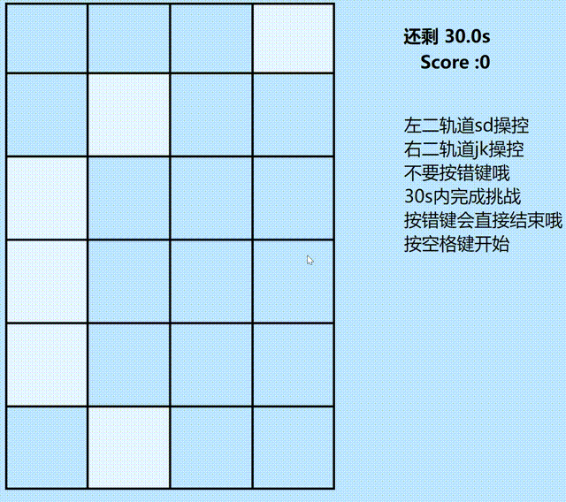

> Contributor: @DASH
>
> 参考 :@Switch

#  写给幼儿园小朋友的H5小游戏指北

## 阅前须知

- **本文主要面向几乎没有开发基础的人** ，如果对canvas有一定了解或者有一定基础，强烈建议去看看隔壁的几道题目，继续下去可能会让你浪费几个小时的生命
- 以下会出现一些Task 和简单的Question，Task可以在你的代码中体现。对于Question而言，强烈建议在提交时另附一份文档写下你的回答。文档的格式不作限制，但不推荐使用[二进制文件](https://en.wikipedia.org/wiki/Binary_file)
- **除文末的Question外**，所有的Task和Question都不会强制要求完成，你只要尽自己最大的努力独立发挥就好，我们乐于在二面的过程中交流你coding过程中遇到的困难与收获。虽然Question的答案基本都可以从搜索引擎中获取答案，但希望你可以以自己的理解表述一遍，而不是ctrl +c ctrl+v
- **Bonus**是一些有挑战性的内容，同样不强制要求完成，我们希望见到你在确保整体完成度的情况下尝试完成这些挑战，或是在额外的文档中写下一部分自己的见解。 
- 单纯完成任务不是目的, 在过程中有所成长才是最大的收获. 请记住: **我们看重的不仅仅是你的能力, 更重要的是你的态度**
- 代码中有参考的部分建议它人注释说明哦，**信息查找**也是开发过程中很重要的一环
- ~~DASH的D是Dimension,请不要惊扰异次元摸鱼的DASH~~
- Happy coding ~ :-D

## 背景导入

平平无奇的一天，DASH在家里~~摆大烂~~大学习

一阵眩晕 醒来已是陌生的潮空间

面前摆了一道谜题 看起来只有完成这个简单的小游戏才能回家了

DASH邀请你一起跟她解决这个谜题

~~实在编不下去了~~

## 目标演示



这只是一个粗糙的演示demo，主要的玩法是按下正确键消灭对应轨道方块，按错的话直接结束游戏，看谁在限定时间能正确消灭的轨道方块最多

相信大家~~的艺术审美肯定能超过DASH~~一定能超过做出比这个美观好玩的版本

## 让我们开始吧

### 开始之前

> 工欲善其事，必先利其器。———《论语·卫灵公》

为了获取更好的开发体验，人们发明了各种有利于开发的工具，我们建议你选择一些趁手的工具，这会极大改善你的开发体验。

如果你完全没有头绪，可以参考以下DASH的开发环境

- [git](https://git-scm.com/)
- [vscode](https://code.visualstudio.com/)(可以自行安装自己喜欢的插件  善用搜索引擎)

~~当然给幼儿园小朋友的题目可以用记事本解决(bushi)~~

### Let's Code!

#### 搭建梯子

首先，潮空间的电脑除了浏览器啥也没有，DASH决定让游戏运行在浏览器内。她在搜索引擎上查了一下，认为自己应该使用html + css +js来完成任务。她创建了一个文件夹，并新建了以下文件

``` 
.
├── index.html
├── index.js
└── index.css
```

(文件名并不唯一，但在潮次元还是谨慎一点好)

> Task 0
>
> 请参考[MDN](https://developer.mozilla.org/en-US/docs/Learn/Getting_started_with_the_web/HTML_basics)搭建一个html文件的框架，其中应包含
>
> - 对网页标题的修改(` title`)
> - 对`.js`和`.css`文件的引入
> - 一个其他文本标签(`<h1>`或别的什么标签)
> - 一个`<canvas>`, 并且请给它一个`id`, 这在之后应该会有大用
> - 其他你觉得需要的东西

之后，她就可以在浏览器中打开这个html文件啦，她看到自己的代码能展示出来，非常高兴

不过她觉得,这个布局不太好看

> Task 1
>
> 通过编写css文件，可以调整canvas与其他元素的位置(实际上真的只需要一点点css知识，如果能用flex box来完成那就更好了
>
> 我们只要求把canvas居中，其他元素的位置可以随意发挥~
>
> - [不懂 css 的话可以戳这里](https://developer.mozilla.org/en-US/docs/Learn/CSS)
>
> - [或许能用到的 flex box 指北](https://css-tricks.com/snippets/css/a-guide-to-flexbox/)

> Question 0
>
> 通过常识/查阅相关资料可以知道, canvas 标签是有`width`和`height`属性的, 而 css 中, 我们也可以给 canvas 设置`width`和`height`, 那么它们有什么不同呢? 如果把它们设置了不一样的值又会发生甚么呢? 请谈谈你的理解

> Bonus 0
>
> 不同的设备拥有不同的窗口宽度与高度。如果需要根据窗口尺寸调整canvas标签宽高，你打算怎么做？

#### 绘画

现在我们已经拥有了一个包含canvas标签和其他一些元素的页面，如果我们想要画些什么的话，想必是要对那个canvas下手了

根据DASH浅薄的理解,想让页面动起来的话应该是js的工作。因此她打开了js文件，准备往里面~~加入灵魂~~写代码

不过DASH 并不会 JavaScript, 所以她决定去找[一个 JS 教程网站](https://javascript.info/)学习一下

她发现, 自己似乎只需要学会[JavaScript Fundamentals 这一章节](https://javascript.info/first-steps)的内容就可以了, 而其中似乎有相当一部分和自己半年前接触到的 C 语言差不多的样子(也就是说大概 4.8.9.10.11.13.14.15 这几个部分草草过一遍就行啦)如果对语法有困惑的话，再返回来看也是可以哒

这个潮空间似乎是二维的，一个2D的画布就足够啦

为了完成这个小游戏，我们似乎得画出一些网格

>Task 2
>
>实现一个在**指定位置** 绘制基础网格的函数，你可以把它起名叫huayigebiaoge()，但DASH建议你遵守[小驼峰命名法](https://wiki.c2.com/?LowerCamelCase)，并取一个好一点的名字(x
>
>网格可以像demo一样~~丑~~ 朴实无华，也可以加入自己的想法，更多个轨道、适度歪曲变形都是可以接受的
>
>为了匹配潮空间的特色，DASH建议你在画完基础表格后再稍微修饰一下，鲜艳的颜色，奇奇怪怪的图案，[复杂的曲线](https://developer.mozilla.org/en-US/docs/Web/API/CanvasRenderingContext2D/quadraticCurveTo)。你也可以使用图片作为网格背景，[渐变色](https://developer.mozilla.org/en-US/docs/Web/API/CanvasRenderingContext2D/createLinearGradient)也是一个好主意。
>
>如果你毫无头绪的话，可以看看[这里](https://developer.mozilla.org/en-US/docs/Web/API/CanvasRenderingContext2D)，它可以带你在潮空间画一个小房子ww

>Question 1
>
>假如你的html 有一个` <canvas id = "canvas"/>`元素，`const myCanvas = document.getElementById('canvas')` 这条语句执行了什么操作?
>
> myCanvas是什么类型的变量?
>
>`getContext`是什么类型的方法?
>
>`myCanvas.getContext()`返回值可能有哪些?

在完成以上这些内容以后，相比你已经对canvas有一定了解了！

还有一些画面中缺失但你觉得重要的元素，就请你自由发挥啦

#### 让画面动起来！

那么显然, 我们现在可以渲染出静态的画面了, 但是如果作为一款游戏, 那么我们肯定是要让我们的格子动起来的

根据[wikipedia 上动画的定义](https://en.wikipedia.org/wiki/Animation), 我们很容易知道, 动画其实是一帧一帧的静画连续播放营造出的效果

那么我们想要播放动画, 自然也需要进行一个按帧的播放

我们非常幸运的找到了这样一个函数: [requestAnimationFrame](https://developer.mozilla.org/en-US/docs/Web/API/window/requestAnimationFrame)

>Task 3
>
>阅读文档(也可以不阅读), 调用`requestAnimationFrame`函数, 按帧渲染刚才你画的基础网格。你还**需要额外突出标记需要击中的方块**，形式可以自由发挥,~~只要别让DASH找不同就行~~
>
>*Hint: 如果想要绘制下一帧的话，需要把上一帧内容清除。如果用一些半透明的矩形遮挡上一帧，可能会有[意想不到的效果](https://developer.mozilla.org/en-US/docs/Web/API/Canvas_API/Tutorial/Advanced_animations#trailing_effect)*

> Question 2
>
> requestAnimationFrame渲染帧的速度与什么有关？你知道 setInterval 函数吗? 使用setInterval函数渲染动画与requestAnimation有何不同?可能会有怎样的问题?谈谈你的理解 

> Bonus 1
>
> 使用`requestAnimationFrame` 函数渲染但控制帧渲染速率约为一定值

DASH觉得这个游戏最**重要**的动画就是键盘按下后方块下落，在完成这个后她还有很多idea(比如做一个连击计数动画)，这些就等着你的自由发挥啦

#### 添加控制

这个游戏已经动起来啦，不过这个游戏还不能操控

DASH找到了一篇[文档](https://developer.mozilla.org/en-US/docs/Web/API/Element/keydown_event),似乎讲述了如何添加键盘按下事件的响应。如果你想添加其他事件的话，可以顺藤摸瓜看看别的ww

> Task 4
>
> 添加控制系统，按下键盘对应键时需要开始游戏／使得网格方块下落／重置游戏

#### 其他

看起来我们的游戏已经基本完工啦～不过还差一点点游戏逻辑

> Task 5
>
> 设置定时器，在游戏开始时启动，在一定时间后关闭并结束游戏
>
> 设置积分板，记录得分
>
> 添加按键是否正确对应方块的判断
>
> - 如果正确对应，分数+1,且方块下移
> - 如果错误，结束游戏，以一种你觉得合适的方式告知玩家
>
> 提供至少一种游戏重新开始的方法
>
> 美化游戏的界面 随意发挥！在潮空间没什么是不可能的
>
> 添加一切你觉得应该有的东西

### 分享

啊 上帝啊 我们就这样完成了一个游戏~

我要把它分享给亲朋好友们耍~

那么, 与其把这几个文件分享出去, 为什么不尝试把它在什么地方部署一下呢?

如果你还没有自己的服务器, [Github Pages](https://pages.github.com/)可以是一个选择.

> Task 6
>
> 在一个什么地方用什么方式部署你的游戏

## Summary

> ### Reflection
>
> 注意: **此题为必答题, 选择本试题的面试者请务必对该问题作出回答**
>
> 在完成整个项目的过程中, 你有什么心得和体会?
>
> 你觉得这篇文章你可以打几分? (满分 10, 保留到整数即可) 如此评分的原因是什么？还有什么意见或建议？
>
> 你还有什么想说的?

那么二面题就到这里了, 期待与你的见面~

以上。
